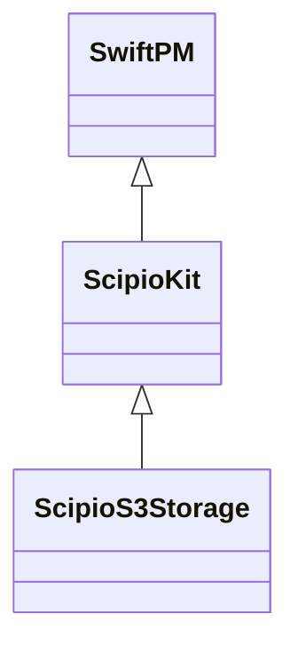
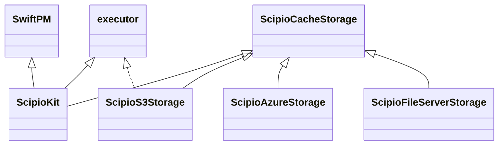

# Abstract Scipio Cache Storage protocol

This is a small library to provide `CacheStorage` protocol.

See details for [Scipio](https://github.com/giginet/Scipio) documentation.

## Motivation

`Scipio` uses swift-package-manager as a dependency, but it doen't follow the semver. 
Thereby, it's hassle to maintain the each cache storage plugin. Each plugin must be updated when the `Scipio` bersion is updated.

I'll show you the structure of the packages.

### Before

In this structure, SwiftPM can't resolve versions of `swift-package-manager`, so all packages must specify the same version at all. It's unuseful to maintain the packages.
Additionally, it's difficult to make the other storage plugin.

### After

`ScipioCacheStorage`helps us to maintain the versioning. It can keep a fewer effort the version management.

Packages except `ScipioKit` doen't depend on `SwiftPM`, so it can follow the standard semver.

If you want to make the other storage plugin, you can make it easily. You just need to implement `CacheStorage` protocol.
